<div align="center">


[](https://git.io/typing-svg)


</div>

---


##  WHO AM I

```bash
┌──(kali㉿kali)-[~]
└─$ neofetch
```

- 🎯 **Cyber Security Student**
- 🐧 **Kali Linux Enthusiast**
- 💻 **Learning Ethical Hacking**
- 🔐 **Future Blue Team Operator**
- 🌱 **Always Learning, Always Growing**

<br clear="right"/>

---

##  TECH STACK

<div align="center">

### 🛠️ Operating Systems & Tools


### 💻 Programming & Scripting


### 🔐 Security Tools


</div>

---

##  LEARNING PROGRESS


```bash
┌─[SKILLS LEVEL]
│
├─[Network Security]
│  Progress: [████████░░] 80%
│
├─[Web Security]  
│  Progress: [██████░░░░] 60%
│
├─[Python Scripting]
│  Progress: [███████░░░] 70%
│
├─[Linux Terminal]
│  Progress: [█████████░] 90%
│
└─[Malware Analysis]
   Progress: [███░░░░░░░] 30%
```

<br clear="right"/>

---

##  GIT STATS

<div align="center">
  


</div>

<div align="center">
  
</div>

---

##  LEARNING PROJECTS


### 🎯 Security Tools

**🔹 [Network Port Scanner](https://github.com/yourusername/port-scanner)**
```python
# Multi-threaded port scanner with banner grabbing
Status: ✅ Completed | Stars: ⭐ 10
Tech: Python, Socket Programming, Threading
```

**🔹 [Password Strength Checker](https://github.com/yourusername/password-checker)**
```python
# Analyze password entropy and complexity
Status: ✅ Completed | Stars: ⭐ 8
Tech: Python, Regex, Security Analysis
```

**🔹 [Web Vulnerability Scanner](https://github.com/yourusername/web-scanner)**
```python
# Automated scanner for common web vulnerabilities
Status: 🔄 In Progress | Stars: ⭐ 5
Tech: Python, Requests, BeautifulSoup
```

### 🛡️ Practice & Labs

**🔹 [TryHackMe Solutions](https://github.com/yourusername/thm-writeups)**
```bash
# My walkthrough and solutions for TryHackMe rooms
Rooms Completed: 25+ | Rank: Top 10%
Focus: Web, Network, Linux Privilege Escalation
```

**🔹 [HackTheBox Writeups](https://github.com/yourusername/htb-writeups)**
```bash
# Detailed writeups for HTB machines
Machines Pwned: 10+ | Active User
Focus: OSINT, Enumeration, Exploitation
```

**🔹 [CTF Challenges](https://github.com/yourusername/ctf-challenges)**
```bash
# Collection of CTF challenges and solutions
Events: 15+ CTFs | Category: Web, Crypto, Forensics
Notable: Top 50 in National CTF 2024
```

### 📚 Learning Resources

**🔹 [Security Notes](https://github.com/yourusername/security-notes)**
```markdown
# My personal cyber security knowledge base
Topics: 50+ | Notes: 200+ pages
Categories: Web Security, Network, Linux, Tools
```

**🔹 [Bash Security Scripts](https://github.com/yourusername/bash-scripts)**
```bash
# Collection of useful security automation scripts
Scripts: 30+ | Use Cases: Automation, Recon, Analysis
```

<br clear="right"/>


---

##  LEARNING JOURNEY


### 📖 What I'm Currently Learning

```bash
[CURRENT FOCUS - December 2024]

1. 🌐 Web Application Penetration Testing
   ├─ OWASP Top 10 vulnerabilities
   ├─ SQL Injection techniques
   ├─ XSS (Cross-Site Scripting)
   └─ Authentication bypass methods

2. 🔍 Network Security & Traffic Analysis
   ├─ Wireshark packet analysis
   ├─ TCP/IP protocol deep dive
   ├─ Network scanning with Nmap
   └─ IDS/IPS fundamentals

3. 💻 Python for Security Automation
   ├─ Socket programming
   ├─ Web scraping for OSINT
   ├─ Building security tools
   └─ Exploit development basics

4. 🐧 Linux System Administration
   ├─ Bash scripting mastery
   ├─ System hardening techniques
   ├─ Log analysis and monitoring
   └─ Privilege escalation methods
```

<br clear="right"/>

### 🎯 Completed Milestones

```mermaid
graph LR
    A[🎯 Start] --> B[Linux Basics]
    B --> C[Networking Fundamentals]
    C --> D[Python Programming]
    D --> E[Web Security]
    E --> F[Network Security]
    F --> G[System Security]
    G --> H[🎓 Junior Security Analyst]
    H --> I[SOC Analyst]
    I --> J[Penetration Tester]
    J --> K[🏆 Security Expert]
    
    style A fill:#00ff00
    style H fill:#00ffff
    style K fill:#ff00ff
```


##  CYBERSECURITY ROADMAP



##  SKILLS BREAKDOWN


### 💻 Technical Skills

<div align="center">

**Programming & Scripting**


**Operating Systems**


**Security Tools Mastery**

| Tool | Proficiency | Use Cases |
|:---:|:---:|:---:|
| 🔍 **Nmap** | ████████░░ 80% | Port scanning, service detection |
| 🦈 **Wireshark** | ███████░░░ 70% | Packet analysis, network forensics |
| 💉 **Metasploit** | ██████░░░░ 60% | Exploitation framework |
| 🔥 **Burp Suite** | ███████░░░ 70% | Web application testing |
| 🐍 **SQLmap** | ███████░░░ 70% | SQL injection automation |
| 🔨 **John the Ripper** | ██████░░░░ 60% | Password cracking |
| 👻 **Hashcat** | █████░░░░░ 50% | Advanced hash cracking |
| 🕷️ **Nikto** | ██████░░░░ 60% | Web server scanning |

</div>

---

##  ACHIEVEMENTS & HIGHLIGHTS


##  BLOG & WRITEUPS

<div align="center">


</div>


<div align="center">

[](https://linkedin.com/in/yourprofile)
[](mailto:your.email@example.com)
[](https://github.com/yourusername)
[](https://discord.com/users/yourid)


</div>

---

<div align="center">

###  MY MOTTO

```
┌─────────────────────────────────────────────┐
│  "Learn Today, Secure Tomorrow"             │
│  "Hack The Planet Ethically"                │
│  "Never Stop Learning, Never Stop Growing"  │
└─────────────────────────────────────────────┘
```


### 🌟 VISITOR COUNT 🌟


**🚀 Keep Learning | 🔒 Stay Secure | 💪 Never Give Up**

</div>
